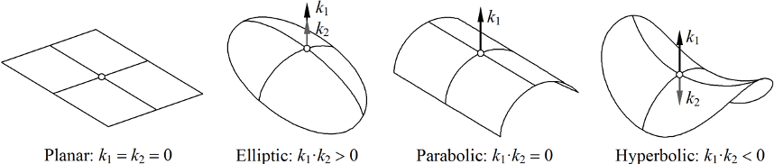
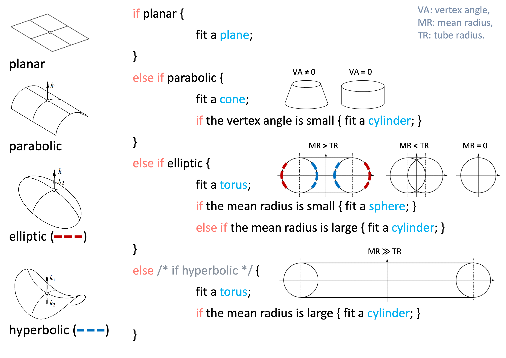

# FindSurface

**Curv*Surf* FindSurface™**

## Overview

FindSurface is a software library that extracts 3D geometric information from point cloud data.

This library supports the following platforms/languages and you can find the distribution of the library for each platform at the link:

**NOTE:** The repositories listed below are presently inaccessible due to internal complications. If you have any inquiries or require further assistance in relation to this matter, please contact to support@curvsurf.com. We greatly appreciate your patience and understanding during this period.

- [iOS (Objective-C/Swift)](https://github.com/CurvSurf/FindSurface-iOS)
- [Android (Java/Kotlin)](https://github.com/CurvSurf/FindSurface-Android)
- [Windows](https://github.com/CurvSurf/FindSurface-Windows)
- [Linux](https://github.com/CurvSurf/FindSurface-Linux)
- [visionOS (Swift)](https://github.com/CurvSurf/FindSurface-visionOS)

> **IMPORTANT**: FindSurface does not work with error-free point clouds, such as procedurally calculated points or vertices from CAD modeling software. It requires points with measurement errors to function as intended. If you want to test FindSurface and don't have such data, we recommend introducing Gaussian-distributed random errors into your error-free data and adjusting the related parameters (i.e., measurement accuracy and mean distance) to match the error-producing configuration.


## How does it work?

FindSurface detects a geometric model in point cloud. It starts searching with a region of interest in the points and spreading the search space until it converges to a specific mathematical representation of one of the geometric shapes according to their local curvature, which has the minimal errors in the distances to the points. The types of the shapes that FindSurface detects are planes (bounded), spheres, cylinders, cones, tori.

The strategy of FindSurface's algorithm, which affects how it spreads its search space or converges to the specific model, is determined by its parameters. The followings are the terms and its meanings that we define for the parameters:

- **Measurement Accuracy** means the *a priori* root-mean-squared error of the measurement points. In most cases, the value of this error is determined by the scanner devices that provide the points, but it may vary depending on the scan distance. Specifically, one can estimate the *a priori* error by getting a linear error model as a function of distance such as `a + b * distance` where `a` is a base noise level and `b` is a coefficient of increase in noise level according to measuring distance. This value is to be used to validate the results of FindSurface by checking whether the *a posteriori* [RMS error](#what-exactly-do-i-get-from-findsurface) is not large enough (e.g., smaller than 1.5 times this *a priori* value). One of the reasons for getting large *a posteriori* RMS errors is due to the model error; the assumed surface model does not represent the measurement points well. You may set this value to an approximated value (about 2x of the actual error) or a heuristically estimated value.

- **Mean Distance** means an average distance between points. This value is determined by the scanner device's resolution and its scan distance. This value is to be used to validate the results of FindSurface by checking the point density of inlier points. It is recommended to set this value to a 2~5 times higher value of the actual one because the inlier points will have lower point density than that of input points.

- **Seed Point (Index)** is a point of interest to start searching for the surface. FindSurface accepts this information as an **index** in the point cloud.

- **Seed Radius** is the radius of a seed region around the seed point where FindSurface starts searching for the surface. This value depends on the size of the geometry that you're interested in. It also had been called **Touch Radius** in the older versions of our library.

  

  Segmentation of the scene image of the point cloud could be helpful to determine the seed point and seed radius. The position and size of a segmented blob can be converted to the point and radius by using the camera parameters of the scene image, which leads to a fully automatic geometric understanding of the scene.

- **Lateral Extension** means the tendency for the algorithm to spread its search space in tangent direction of the surface to be sought. A larger plane or a longer cylinder might be detected as you set it to a higher value, and vice versa. Lateral extension has no influence to searching for a sphere or a torus.

- **Radial Expansion** means the tendency for the algorithm to thicken/thin its search space in normal direction of the surface to be sought. If the measurement points are releatively accurate/inaccurate, the most/least points might be considered as inlier points as you set it to a higher/lower value (level of inlier/outlier inclusion/exclusion). In other words, it is recommended not to set it to a lower/higher value for relatively accurate/inaccurate measurement points.

- **Inlier / Outlier Flags** can be queried as an array of boolean flags from FindSurface, which tells if the point of the corresponding index should be considered to be in inliers. 

  

  


## What exactly do I get from FindSurface?

FindSurface produces the following information as the outputs of its algorithm:

- **RMS error** means the *a posteriori* root-mean-squared error between the inlier points and the detected surface.
- **Feature Type**: the geometric type of the detected surface (plane, sphere, cylinder, cone, torus)
- **Sizes and positions** corresponding to the type:
  - The coordinates of **four corner** points of a plane (named as lower left, lower right, upper left, upper right).
  - The **center** coordinates and the **radius** of a sphere.
  - The **center** coordinates at both ends and the **radius** of a cylinder (named as top, bottom, radius).
  - The **center** coordinates and the **radii** at both ends of a cone (named as top, bottom. top radius, bottom radius).
  - The **center** coordinates and the **radius** of a torus, its **axis** vector, and the **tube radius** (named as center, mean radius, normal, tube radius).
  - The normal/axis of plane/cylinder/torus is arbitrarily chosen between two alternatives by the algorithm.
- Boolean array of which elements tells you whether the points in the corresponding indices are considered as **inlier points** by the algorithm.


## Auto Detection

FindSurface can detect the following five surface types from input points:

- Bounded Plane (rectangle)
- Sphere
- Cylinder
- Cone (including conical frustum)
- Torus

The algorithm of FindSurface is capable of "**Auto Detection**", which means it can detect the most fit surface type among the five types above around the seed area without specifying the feature type manually. The resulted surface type is automatically determined when the surface model converges to a specific surface type.

The algorithm takes advantage of the fact that locally non-singular (i.e., differentiable) surfaces can have one of the following curvature types: 



One or more of these four types can comprise [the five surface types](#auto-detection), as follows:

- Planes are planar;
- Spheres are elliptic;
- Cylinders are parabolic;
- Cones are parabolic;
- Tori are locally elliptic, hyperbolic, and parabolic.

Given the seed point, the algorithm analyzes the local curvature of the region around the seed, which makes it possible for the algorithm to assume the initial surface model from the curvature. As the seed region grows, the surface model evolves into one of the five surface types. The following pseudo-code depicts the process taking place in the algorithm:

##### pseudo-code

````c
if planar {
    fit a plane;
}
else if parabolic {
    fit a cone;
    if the vertex angle is small {
        fit a cylinder;
    }
}
else if elliptic {
    fit a torus;
    if the mean radius is small {
        fit a sphere;
    }
    else if the mean radius is large {
        fit a cylinder;
    }
}
else /*if hyperbolic*/ {
    fit a torus;
    if the mean radius is large {
        fit a cylinder;
    }
}
````



To use auto detection feature, set the enum value representing any type (e.g., [`FS_TYPE_ANY`](https://github.com/CurvSurf/FindSurface-Windows/blob/master/FindSurface-API-reference-C.md#fs_feature_type) for C, `FeatureType::any` for Kotlin) to the feature type parameter of `findSurface` function, instead of setting a specific type.

The auto detection performs well if the following conditions are met:

- Large coverage area of the measurement points over the surface to be detected (e.g., larger than half the diameter/width of the surface to be detected);

- Accurate measurement points (e.g., the [measurement error](#how-does-it-work) is smaller than one 10th of the radius/size of the surface to be detected);
- Large [seed radius](#how-does-it-work) (e.g., larger than 10 times of the point [measurement error](#how-does-it-work) size)


## Smart Conversion

In the mathematical models of the geometric surfaces that the algorithm of FindSurface builds, there are some special relations between the surfaces in terms of geometric topology. For example, a cone (conical frustum) that has the same radii at both its top and bottom is actually a cylinder. After the model converges to a specific surface type, Smart conversion, if enabled, automatically converts the type according to the relations. Smart conversion converts:

- A cone (conical frustum) that has the same radii at both its top and bottom into a cylinder;
- A degenerate torus (a double-covered sphere), of which mean radius is zero, into a sphere ([this gif](https://en.wikipedia.org/wiki/File:Sphere-like_degenerate_torus.gif) will help you understand what it is);
- A torus that has an infinite mean radius into a cylinder;

See the [pseudo-code](#pseudo-code) in the [Auto Detection](#auto-detection) section since it depicts the conversion criteria too.

To enable Smart Conversion, enum values corresponding to the options must be set to the context manually.

> **Important**: Enable all smart conversion options. Because of the nature of the union used as FindSurface's result data structure, interpreting the un-converted results in usual ways might cause   incorrect results when the results need to be converted. **Please enable all the options** before use.

>Note: The options do not affect the behavior of Auto Detection since Auto Detection converts the types even if no options are enabled, as if all is enabled.


## ---

(c) Copyright 2021 CurvSurf, Inc. All rights reserved.

This library's ownership is solely on CurvSurf, Inc. and anyone can use it for non-commercial purposes. Contact to support@curvsurf.com for commercial use of the library.
